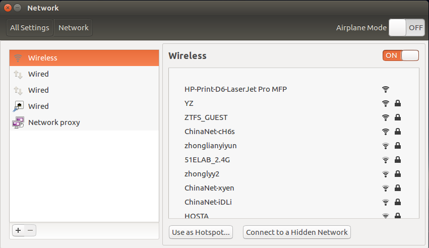

# Nvidia Jetson TX2 as Access Point

# TX2热点设置

[TOC]

## 步骤

- **步骤一：**关闭WIFI连接 Disconnect WIFI
- **步骤二：**系统设置-网络 System settings-Network



- **步骤三：**使用热点Use as Hotspot
- **步骤四**：进入Normal栏，进入常规页面，勾选`可用时自动链接到这个网络`
- **步骤五：**配置该热点的相关信息，connection name取名`ap_name`，SSID也就是该热点WIFI的名称，自己任意取，`mode`设置为`Hotspot`
- **步骤六：**进入Wi-Fi Security栏，设置加密方式`WPA&WPA2`和密码
- **步骤七：**进入IPv4 Settings栏，设置`Shared to other computers`
- **步骤八：**打开终端输入`sudo vim /etc/NetworkManager/system-connections/ap_name`，确认`mode=ap`
- **步骤九：**打开终端输入`sudo vim /etc/modprobe.d/bcmdhd.conf`，打开后在配置文件的最后加入以下行，保存。

```bash
options bcmdhd op_mode=2
```

- **步骤十**：重启

## 参考

* [https://www.myzhar.com/blog/the-myzharbot-project/software/nvidia-jetson-tx1-access-point/](https://www.myzhar.com/blog/the-myzharbot-project/software/nvidia-jetson-tx1-access-point/)

  !{There is a simple way to enable Wifi access point on Ubuntu using Unity default Network Manager:

  Disable WIFI and plug in an internet cable to your laptop so that your Ubuntu is connect to a wired internet and wireless is disabled.
  Go to Network Icon on top panel -> Edit Connections …, then click the Add button in the pop-up window.
  Choose Wi-Fi from the drop-down menu when you’re asked to choose a connection type
  In next window, do:
  Type in a connection name (i.e. MyzharBot-v4-AP). The name will be used later.
  Type in a SSID (i.e. MyzharBot-v4-AP)
  Select mode: Infrastructure
  Device MAC address: select your wireless card from drop-down menu.
  Go to Wi-Fi Security tab, select security type WPA & WPA2 Personal and set a password. You can also leave the connection Open… it’s your oen choise.
  Go to IPv4 Settings tab, from Method drop-down box select Shared to other computers.
  Click Save
  After above steps, a configuration file created under “/etc/NetworkManager/system-connections“directory. File name is the same to the connection name you typed in step 3-B.

  Now press Ctrl+Alt+T on keyboard to open terminal. When it opens, paste the commands below and hit enter to edit the configuration file:

  sudo gedit /etc/NetworkManager/system-connections/wifi-hotspot

  Replace wifi-hotspot with the connection name you typed in step 3-B (i.e. MyzharBot-v4-AP).
  When the file opens, find out the line mode=infrastructure and change it to mode=ap.
  Finally save the file.
  Differently from Nvidia Jetson TK1, we need another little hack for Nvidia Jetson TX1 to enable the SSID broadcast:

  In the terminal open the file /etc/modprobe.d/bcmdhd.conf for editing:


  sudo gedit /etc/modprobe.d/bcmdhd.conf

  Add the following line at the end of the file:


  options bcmdhd op_mode=2

  Save and reboot the Nvidia Jetson TX1
  When everything’s done, enable WIFI from Network Manager icon on the panel. It should automatically connect to the hotspot you created. If not, select “Connect to Hidden Wi-Fi Network …” and select it from the drop-down box.

  The robot will now get automatically the IP 10.42.0.1 and a DHCP server is enabled, so every device that connects to “MyzharBot-v4-AP” will get an IP in the class 10.42.0.*

  When you will boot the Jetson TX1 after this configuration theMyzharBot-v4-AP willl be automaticaclly active, so if you want to connect to a different wifi network you must disconnect it and select one of the available connection using Network Manager.}


